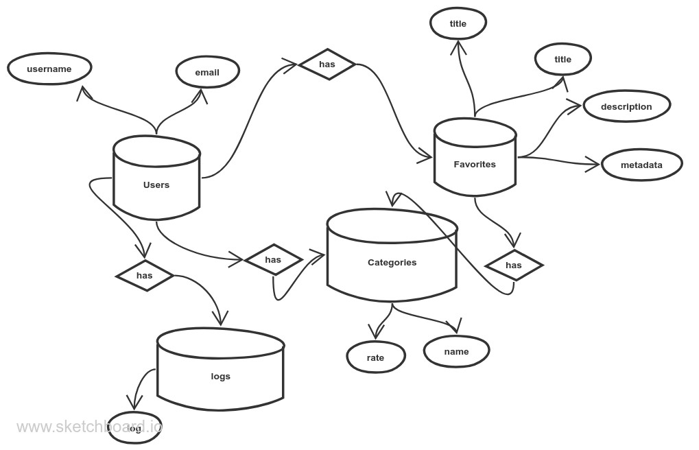

# favorite-things
it's an app to manage the user favorites and give them a rank

# What is included?
- Flask as server-side framework
- Flask Blueprints for project structure
- flask-wtf for forms
- flask-sqlalchemy for databases
- flask-login for user authentication and session management
- flask-bcrypt for passwords hashing & checking
- Jinja2 for templating 
- jQuery for AJAX requests and UI interactivity 
- Bootstrap as front-end framework
- Font Awesome to add UI icons

# Structure & Design
### Database
This project has its database designed with 4 main entities:
- **User**: The user can create his own favorite with a category and every user has his log for all activities
- **Favorites**: the favorites for the user be created with a rank
- **Categories**: The Category of a favorite with the rank
- **Logs**: Store all logs for the user activity

#  The entity relationship diagram


So, a User has Clients, a Client has Products, a Product has FeatureRequest's and ProductArea's, and each FeatureRequest is assigned to a specific Product for a specific ProductArea.

### Backend
The project utilizes Flask Blueprints to separate the backend logic into the following packages:
- **main**: has the basic like home and about directories.
- **users**: has the authentication and directories.
- **favorites**: has the routes related to favorites.
- **Categories**:has the routes and some logics related to categories.
-**logs**:has the routes for logs.

### Frontend 
Jinja2, WTForms, Bootstrap, and jQuery to help the user to interact with the system and make it better to see.


# Setting up locally
#### Clone the repo
```
   Clone the repo
```

#### Initialize virtual environment
##### Assuming you have Python 3.* and python3-venv installed 
```
    python3 -m venv ./venv
    source venv/bin/activate
```

#### Install the dependencies
```
    pip install -r requirements.txt
```

#### ... and run
```
    python run.py
```